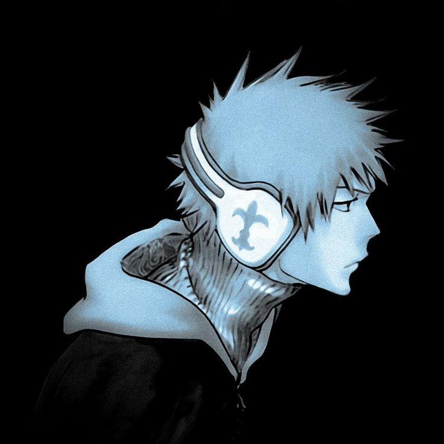

<html lang="pt-br">
<head>
    <meta charset="UTF-8">
    <meta name="viewport" content="width=device-width, initial-scale=1.0">
    <title>Carlos Henrique - Portfólio</title>
    <link rel="stylesheet" href="css/style.css">
</head>
<body>
    <header>
        
        <h1 class="head">Carlos Henrique Morais de Oliveira</h1>
            <h2 class="head">Desenvolvedor Web & Apps</h2>
    </header>
    <ul style="list-style-type:circle;">
        <h1>Sobre Mim:</h1>
            <li><h2>Biografia</h2>
            
<strong>Idade:</strong> 19 anos (30/06/2004)

            
<strong>Cidade:</strong> São Bernardo do Campo - SP

            
<strong>Sobre:</strong> Faço faculdade na Anhanguera, curso Análise e Desenvolvimento de Sistemas, comecei no primeiro semestre de 2023. Meus hobbies são coisas geeks como jogos (Pokémon, Zelda, Efootball, etc), animes, e também, codar (isso bastante).
</li>
        <h2>Educação:</h2>
            <li>
Instituições de ensino frequentadas:
                
SENAI Mario Amato - Fundamentos de Programação Web e Mobile   (08/2023 - 12/2023) (CONCLUIDO)

                
Faculdade Anhanguera - Análise e Desenvolvimento de Sistemas   (02/2024 - atual) (CURSANDO)

            
</li>
            <li>
Graus Obtidos:
 
                
Tecnólogo (ADS - Faculdade Anhanguera)
</li>
            <li>
Certificações: 
                
Capacitação Profissional (Fundamentos de Programação Web e Mobile - SENAI)
            
</li>
        <h2>Habilidades:</h2>
            <li>
Habilidades Técnicas:
                
Suporte ao Cliente

                
Correção de Erros

                
Codificação

                
Informática Avançada

                
Desenvolvimento e Design

                
Idiomas

                
Manutenção

                
Resolução de Problemas

                
Suporte Técnico

</li>
            <li>
Habilidades Interpessoais: 
                
Trabalho em equipe

                
Resolução de Conflitos

                
Comunicação

                
Empatia

                
Tolerância

                
Trilíngue (Português, Inglês e Espanhol)

            
</li>
            <li>
Idiomas:
                
Português (Nativo)

                
Inglês (Avançado)

                
Espanhol (Médio)

            
</li>
        <h2>Portfólio:</h2>
            <li>
<a href="https://github.com/carloshenriquemorais" target="_blank">Projetos</a>
</li>
        <h2>Contato:</h2>
            <li>
Email: <strong>carlosmorais932@gmail.com</strong>
</li>
            <li>
Whatsapp: +55 (11) 96280-9722
</li>
    </ul>
</body>
</html>
